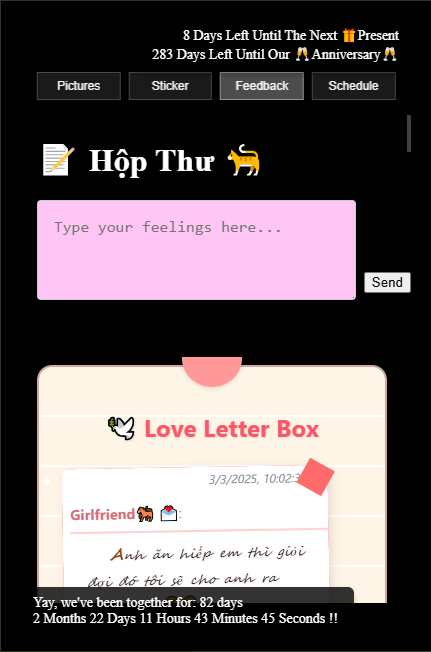

# House of Iris


A personal memory storage application built with modern web technologies.

## Overview

House of Iris is a personal project for storing memories, including photos, videos, and love letters. It provides a secure and intuitive interface for managing personal content.

## Demo

Check out the live demo: [https://houseofiris.vercel.app/](https://houseofiris.vercel.app/)



## Technology Stack

- **Next.js** (15.1.4): React framework for web applications
- **React** (18.3.1): JavaScript library for building user interfaces
- **TypeScript** (5): Typed JavaScript superset
- **Tailwind CSS** (3.4.17): Utility-first styling
- **Chakra UI** (3.3.1): Accessible UI components
- **Framer Motion** (11.18.0): React animations
- **Redis** (3.0.0): In-memory data store
- **Cloudinary** (2.5.1): Image & video CDN
- **EmailJS** (4.4.1): Client-side email API
- **Axios** (1.7.9): HTTP client
- **React Query** (5.64.0): Data fetching & caching

## Quick Start

### Prerequisites

- Node.js (14.x or later)
- npm (6.x or later)

### Installation

1. Clone the repository:
   ```bash
   git clone https://github.com/yourusername/houseofiris.git
   cd houseofiris
   ```

2. Install dependencies:
   ```bash
   npm install
   ```

3. Set up environment variables:
   Create a `.env.local` file with the following variables:
   ```
   NEXT_PUBLIC_CLOUDINARY_URL=your_cloudinary_url
   EMAILJS_USER_ID=your_emailjs_user_id
   REDIS_URL=your_redis_url
   ```

4. Start the development server:
   ```bash
   npm run dev
   ```

5. Open [http://localhost:3000](http://localhost:3000) in your browser.

## Build for Production

```bash
npm run build
npm start
```

## Deployment

The application is deployed on Vercel. For detailed deployment instructions, see [docs/DOCUMENTATION.md](./docs/DOCUMENTATION.md#overview).

## Core Features

- Memory Storage: Manages personal memories
- User Authentication: Handles login and registration
- Media Upload: Uploads photos and videos to Cloudinary
- Email Notification: Sends notifications using EmailJS
- Gallery: Displays photos in a gallery format
- Feedback: Collects and displays user feedback

## Documentation

All project documentation is now consolidated in a single, comprehensive document:

- [Unified Documentation](./docs/DOCUMENTATION.md): Complete project documentation with all information in one place

The documentation includes:

- [Overview](./docs/DOCUMENTATION.md#overview): Project overview, features, and installation
- [Development Guidelines](./docs/DOCUMENTATION.md#development-guidelines): Coding standards and best practices
- [Testing](./docs/DOCUMENTATION.md#testing): Testing approach and guidelines
- [Performance](./docs/DOCUMENTATION.md#performance): Performance optimization strategies
- [UI/UX](./docs/DOCUMENTATION.md#uiux): UI/UX guidelines and components
- [API and State Management](./docs/DOCUMENTATION.md#api-and-state-management): API structure and state management
- [Troubleshooting](./docs/DOCUMENTATION.md#troubleshooting): Common issues and solutions

## Testing

```bash
npm test
```

For detailed testing guidelines, see [docs/DOCUMENTATION.md#testing](./docs/DOCUMENTATION.md#testing).

## Contributing

1. Fork the repository
2. Create your feature branch (`git checkout -b feature/amazing-feature`)
3. Commit your changes (`git commit -m 'Add some amazing feature'`)
4. Push to the branch (`git push origin feature/amazing-feature`)
5. Open a Pull Request

## License

MIT © [Luong Dang](https://github.com/luongkhdang)
